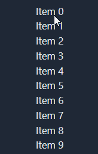

# Blazor Drag&drop list

Minimal implementation of drag & drop list in Blazor. Updated to .NET 8.

Ask a question in  or open an issue.

Check the [demo website](https://tesar-tech.github.io/DragAndDropList/).

No extra js library needed.

Inspired by: https://chrissainty.com/investigating-drag-and-drop-with-blazor/
