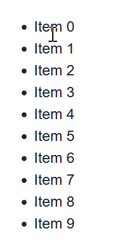

# Drag and drop list in Blazor 

Minimal implementation of drag & drop list. Blazor WebAssembly.

No extra js library needed.

Whole implementation is in [Index.razor](DragAndDropList/Pages/Index.razor).

More advanced solution with child elements: [Index2.razor](DragAndDropList/Pages/Index2.razor) 
(resolves this SO issue ['dragleave' of parent element fires when dragging over children elements](https://stackoverflow.com/questions/10867506/dragleave-of-parent-element-fires-when-dragging-over-children-elements) )

Inspired by: https://chrissainty.com/investigating-drag-and-drop-with-blazor/
